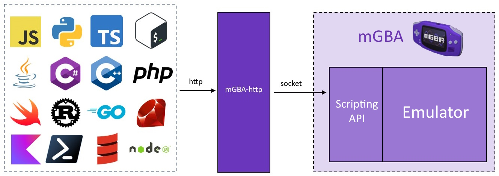

# mGBA-http

An HTTP interface for mGBA scripting. As long as you make HTTP requests, you'll be able to interact with mGBA.

⭐ I've written about this on [my blog](https://www.nikouusitalo.com/blog/use-any-language-to-control-mgba/)! 📝

## Features
- Interact with mGBA with any language that supports HTTP
- Full Swagger API documentation (swagger.json and SwaggerUI) for fast prototyping and integration
- Maps 1 to 1 with most of the mGBA scripting API
- Custom button APIs for easy button interaction
- Cross platform
- Easy to setup

This project is great if you want to:
- Create a "Twitch Plays" 
- Write an AI bot in your preferred programming language
- Create an information dashboard for the current game (e.g. show your current Pokémon's stats like [Pokélink](https://twitter.com/pokelinkapp))
- Edit the memory of the running game

## Example

In the example below, we accept inputs from one program and send them to mGBA:
- (top left) is accepting key inputs from keyboard and sending them to mGBA-http
- (top right) mGBA-http is forwarding these to mGBA
- (bottom left) mGBA's built-in scripting API accepting the requests from mGBA-http
- (bottom right) then the key inputs are read by the ROM

https://github.com/user-attachments/assets/e136f6f3-5a17-49fa-8160-ee33609080a1

If you want to see more real examples with videos, code, and explanations, check out the [examples page](docs/Examples.md).

There are also C# examples I use for testing in the [testing](testing) folder.

## Quick Start Guide
mGBA-http works with 0.10.2+.

### The full mGBA-http experience

1. Ensure you have [mGBA](https://mgba.io/downloads.html)
1. Download mGBA-http and mGBASocketServer.lua from the [Releases](https://github.com/nikouu/mGBA-http/releases/latest) section 
1. Run mGBA-http
1. In mGBA, go to Tools > Scripting, then File > Load script and load in mGBASocketServer.lua

Once a ROM is loaded, you are now ready to start using mGBA-http.

For a more in-depth guide with pictures, see the [Full Guide (application)](docs/FullGuide.md).

### Just the script

A lot of users find the [mGBASocketServer.lua](mGBASocketServer.lua) script alone is useful enough for their projects. See the following for which version to download:

- [Version 0.5.0](https://github.com/nikouu/mGBA-http/releases/tag/0.5.0) and lower is easier to use. Simply fire off the message
- [Version 0.6.0](https://github.com/nikouu/mGBA-http/releases/tag/0.6.0) and higher requires `<|END|>` to be at the end of the request, and will reply with `<|END|>` at the end of the response.

For a more in-depth guide with pictures, see the [Full Guide (lua script only)](docs/FullGuide-lua.md).

## Limitations
- No frame perfect calls. There is network latency between your application to mGBA-http and again latency between mGBA-http and mGBA. This will not be accurate for frame perfect manipulation and is meant for more general usage such as for "Twitch plays", AI playing bot, or other non frame specific application. For high accuracy manipulation see [Bizhawk](https://tasvideos.org/BizHawk/) which is used for TASBots.
- Not all scripting calls are implemented. See [ImplementedApis.md](docs/ImplementedApis.md) for the list of what is implemented.
- The OSX and Linux binaries are experimental.

## Why?
This project came about because I didn't know lua and wanted to use C# control emulated Pokémon games in a cross platform way. I was there for and loved Twitch Plays Pokémon and looking around, most GitHub projects for "X plays" style emulator controllers use the Windows SendKey API (or similar abstraction) regardless of language. 

When investigating how [Ironmon-Tracker](https://github.com/besteon/Ironmon-Tracker) worked after seeing it on [Arex's stream](https://www.twitch.tv/arex), I noticed [mGBA has a scripting API](https://mgba.io/docs/scripting.html) and more specifically a [socket API](https://mgba.io/docs/scripting.html#lua-root-socket) which I could interact with via C# and it went from there[[1]](https://github.com/nikouu/mGBA-lua-HelloWorld)[[2]](https://github.com/nikouu/mGBA-lua-Socket).

mGBA-http builds on the mGBA socket API abstraction and adds an HTTP layer to simplify interaction and development - which is exactly what I want for future projects.

Future projects such as the proof of concept: [CPU Plays Pokemon](https://github.com/nikouu/CPU-Plays-Pokemon)

## Contributing
If you know Lua, GameBoy/Advance, or mGBA specifics, I'd love for help. 

### Development
If you're a .NET developer, the setup simple and familiar opening the [solution file](src/mGBAHttp.sln). I use Visual Studio (At least VS 17.9) and the latest .NET. However, if you choose to develop C# without Visual Studio, that's fine too. 

If you're not a .NET developer, check out the comprehensive [C# learning website](https://dotnet.microsoft.com/en-us/learn/csharp) from Microsoft. You can program in C# on whatever platform whether it's Windows, Mac, or Linux.

In terms of the .NET work, the project uses [ASP.NET Core minimal API](https://learn.microsoft.com/en-us/aspnet/core/fundamentals/minimal-apis?view=aspnetcore-8.0).

#### Design Document
The rough design philosphy is outlined in the [design document](docs/Design.md). Please understand and follow this when considering a contribution.

### Build
The PowerShell release script [ReleaseBuild.ps1](ReleaseBuild.ps1) creates the final binaries. PowerShell is cross platform and can be downloaded via the [PowerShell download documentation](https://learn.microsoft.com/en-us/powershell/scripting/install/installing-powershell?view=powershell-7.3).

The script generates binaries closely aligned with the desktop operating systems and architectures that [mGBA provides downloads](https://mgba.io/downloads.html) for.

#### Cross Platform
To reduce the barrier of entry, mGBA-http also has [self-contained](https://learn.microsoft.com/en-us/dotnet/core/deploying/#publish-self-contained) builds. These are the larger binaries with "self-contained" in the filename and bring the entirity of .NET needed to run the executable - meaning the user does not need to download the [.NET runtime](https://dotnet.microsoft.com/en-us/download/dotnet/8.0) to use mGBA-http.

## Contact
If there's a problem feel free to start an issue, otherwise see [my about page](https://www.nikouusitalo.com/about/#contact) on how to contact me. 

## Acknowledgments
- The mGBA GitHub team for having socket examples
- [Zachary Handley](https://zachhandley.com/) for paving the way with the initial [button press code](https://discord.com/channels/453962671499509772/979634439237816360/1124075643143995522)
- [heroldev/AGB-buttontest](https://github.com/heroldev/AGB-buttontest) for a simple button testing ROM

[References.md](docs/References.md) has useful links during development.

This project is not associated with the development or development team of mGBA. I'm just a fan ✌

## Links
- [mGBA Website](https://mgba.io/)
- [mGBA GitHub](https://github.com/mgba-emu/mgba)
- [mGBA Discord](https://discord.gg/em2M2sG)
- [My Website](https://www.nikouusitalo.com/)

## License
[MIT](LICENSE)

If you end up using mGBA-http, [drop me a message](https://www.nikouusitalo.com/about/#contact) and tell me what you're up to!
