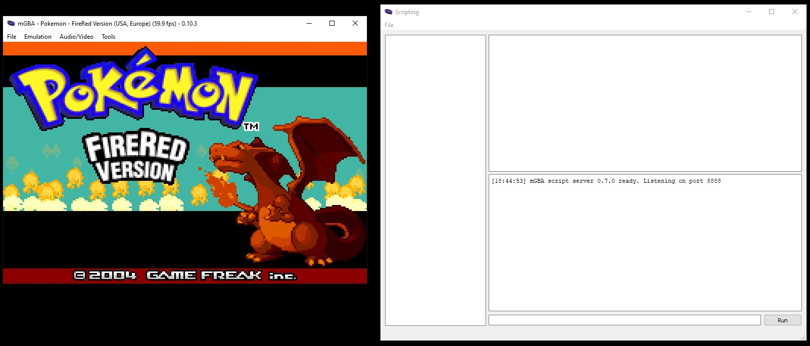

# Full Guide (lua script only)

This guide is for using the .lua script. If you need to use the full application, see [Full Guide (application)](/docs/FullGuide.md).


## Setup

1. Ensure you have [mGBA](https://mgba.io/downloads.html)
1. Download both mGBA-http and `mGBASocketServer.lua` from the [Releases](https://github.com/nikouu/mGBA-http/releases/latest) section.
	- **Which version of mGBASocketServer.lua?** 
		- [Version 0.5.0](https://github.com/nikouu/mGBA-http/releases/tag/0.5.0) and lower is easier to use. Simply fire off the message
		- [Version 0.6.0](https://github.com/nikouu/mGBA-http/releases/tag/0.6.0) and higher requires `<|END|>` to be at the end of the request, and will reply with `<|END|>` at the end of the response.
1. Open mGBA and click Tools > Scripting to open the Scripting window.

1. In the scripting window click File > Load script to bring up the file picker dialog.

1. Select the `mGBASocketServer.lua` file you downloaded earlier
1. Load up a ROM in mGBA
1. Done, the lua script is ready to accept commands


## Usage

By default the script will listen to port 8888.

To see what mGBA scripting APIs are implemented, see the [implemented APIs document](ImplementedApis.md).

### Python example

For version 0.5.0 and lower:

```python
import socket

HOST = "127.0.0.1"
PORT = 8888

with socket.socket(socket.AF_INET, socket.SOCK_STREAM) as s:
    s.connect((HOST, PORT))
    s.sendall(b"core.getGameTitle")
    data = s.recv(1024).decode()

print(f"Game Title: {data}")
```

For version 0.6.0 and higher:

```python
import socket

HOST = "127.0.0.1"
PORT = 8888 
TERMINATION_MARKER = "<|END|>" 

with socket.socket(socket.AF_INET, socket.SOCK_STREAM) as s:
    s.connect((HOST, PORT))
    
    command = "core.getGameTitle" + TERMINATION_MARKER
    s.sendall(command.encode())
    
    buffer = ""
    while True:
        chunk = s.recv(1024).decode()
        buffer += chunk
        
        if TERMINATION_MARKER in buffer:
            response = buffer.split(TERMINATION_MARKER)[0]
            break

print(f"Game Title: {response}")
```

_Examples inspired by [Socket Programming in Python by Nathan Jennings](https://realpython.com/python-sockets/)_

## Configuration

Depending on the version, the script has some easy to configure options for logging and the port number at the top.