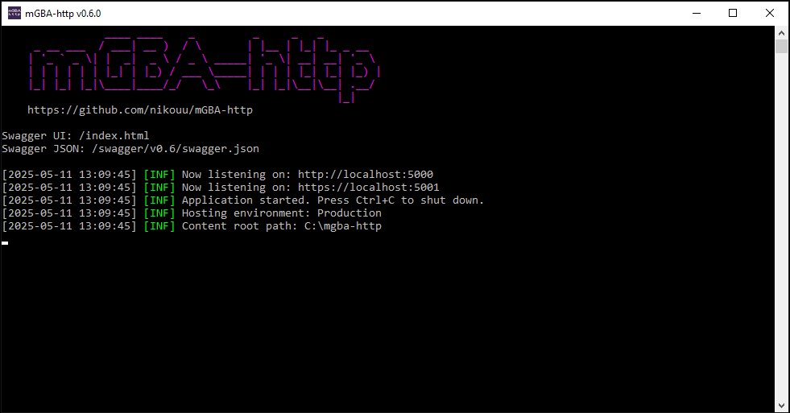
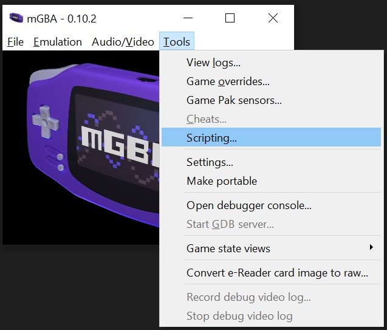
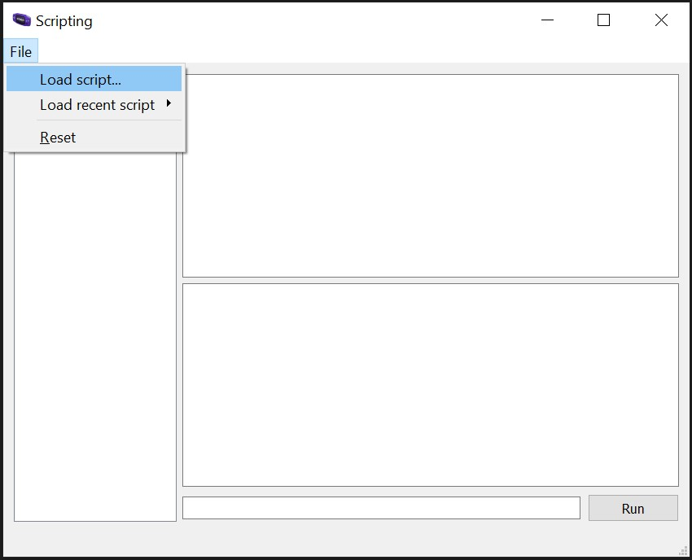
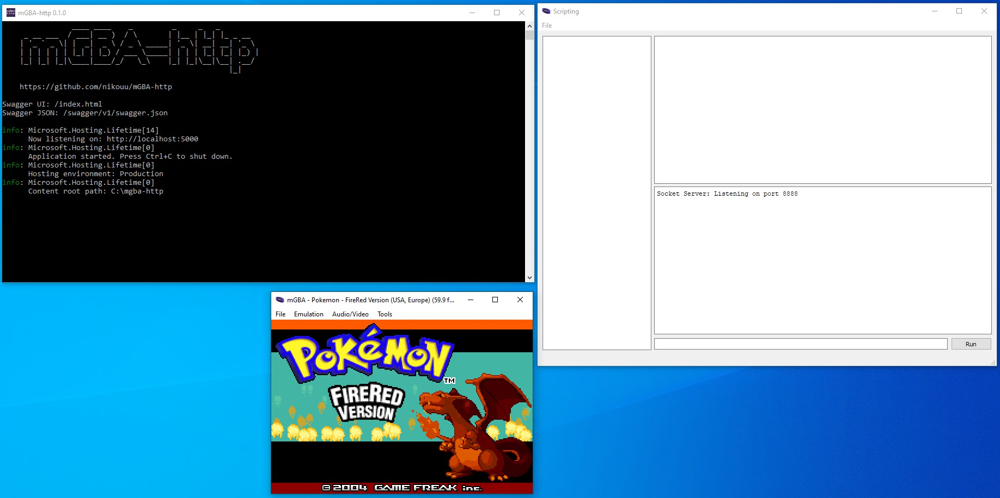
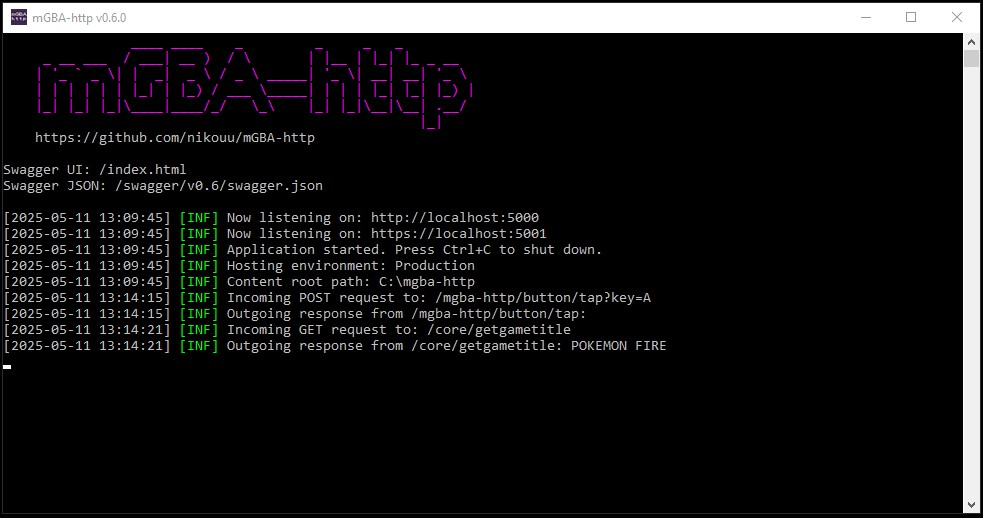
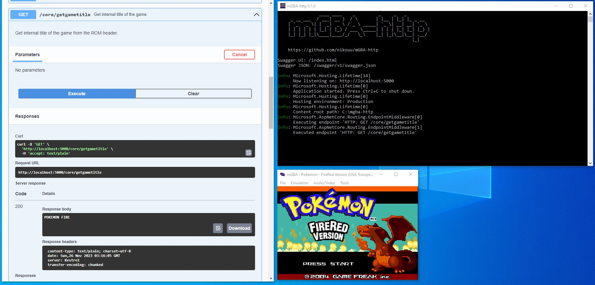
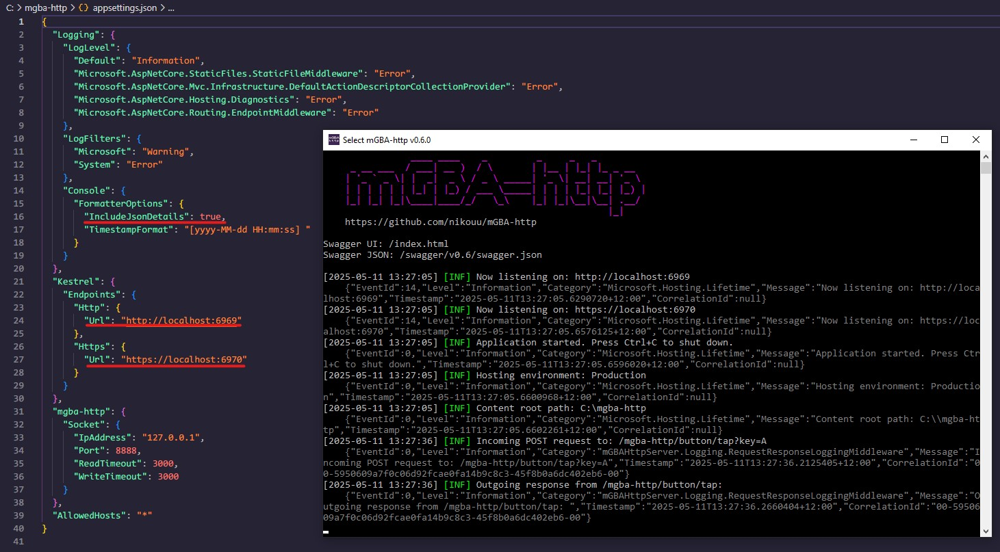

# Full Guide (application)

This guide is for using the full mGBA-http application. If you only need to use the .lua script, see [Full Guide (lua script only)](/docs/FullGuide-lua.md).

## Setup

1. Ensure you have [mGBA](https://mgba.io/downloads.html)
1. Download both mGBA-http and `mGBA-http.lua` from the [Releases](https://github.com/nikouu/mGBA-http/releases/latest) section.
2. Run mGBA-http

1. Open mGBA and click Tools > Scripting to open the Scripting window.

1. In the scripting window click File > Load script to bring up the file picker dialog.

1. Select the `mGBA-http.lua` file you downloaded earlier
2. Load up a ROM in mGBA
3. Done. mGBA is now ready to accept commands from mGBA-http.




## Usage

When running, mGBA-http presents as a mostly non-interactiable console, with the default start information of:
- The bound address. This is the root for the commands. Default: `http://localhost:5000`
- The ScalarUI address. Default: `http://localhost:5000/scalar`
- The OpenAPI JSON address. Default: `http://localhost:5000/openapi/v1.json`

Log entries of what commands are being sent as well as errors will show up in this console.


A quick way to begin to sending commands is heading to the SwaggerUI address and reqesting the ROM title as it requires no parameters:



See below for more examples, and the [mGBA scripting documentation](https://mgba.io/docs/scripting.html).

- To see what mGBA scripting APIs are implemented, see the [implemented APIs document](ImplementedApis.md).
- To explore the API (not live), see the [GitHub Pages Scalar API documentation](https://nikouu.github.io/mGBA-http/).
- Finally, the full [OpenAPI JSON file](https://nikouu.github.io/mGBA-http/openapi.json).

### Configuration
If needed, there are minimal configuration points

#### appsettings.json
This file is **not** required for running mGBA-http normally. 

However, if you need further configuration, download this file from the releases page and put it in the same directory as mGBA-http. mGBA-http will pick up on these settings when run. See the [ASP.NET Core logging documentation](https://learn.microsoft.com/en-us/aspnet/core/fundamentals/logging/#configure-logging) for more.

The following configuration is available:

| Config                          | Default                 | Command line  | Notes                                                                  |
| ------------------------------- | ----------------------- | ------------- | ---------------------------------------------------------------------- |
| `Urls`                          | `http://localhost:5000` | `--urls`      | The address mGBA-http listens on.                                      |
| `mgba-http:Console:Detailed`    | `false`                 | `--detailed`  | Adds a correlation ID, status code and timing under each request line. |
| `mgba-http:Socket:IpAddress`    | `127.0.0.1`             | `--mgba-ip`   | The address mGBA is on.                                                |
| `mgba-http:Socket:Port`         | `8888`                  | `--mgba-port` | The port mGBA is on. Must match `port` in the Lua script.              |
| `mgba-http:Socket:ReadTimeout`  | `3000`                  |               | Milliseconds to wait for mGBA to reply.                                |
| `mgba-http:Socket:WriteTimeout` | `3000`                  |               | Milliseconds to wait for mGBA to accept a command.                     |

Command line arguments override `appsettings.json`. They take a value rather than acting as flags, so use `--detailed true`.

##### Enabling HTTPS (optional)

By default, mGBA-http runs on HTTP only. To add HTTPS, add an `https` address to `Urls` in `appsettings.json`:

```json
"Urls": "http://localhost:5000;https://localhost:5001"
```

HTTPS requires a valid certificate. The easiest way to get this going is by having the [.NET SDK installed](https://dotnet.microsoft.com/en-us/download), then you can generate and trust a development certificate by running:

```
dotnet dev-certs https --trust
```

If you do not have the .NET SDK, you must provide a certificate file explicitly:

```json
"Kestrel": {
  "Endpoints": {
    "Http": {
      "Url": "http://localhost:5000"
    },
    "Https": {
      "Url": "https://localhost:5001",
      "Certificate": {
        "Path": "path/to/cert.pfx",
        "Password": "your-password"
      }
    }
  }
}
```

Note: Delete the Urls setting when you use the Kestrel section. The Kestrel endpoints replace Urls, and the startup banner shows the unused Urls address.

### mGBA-http.lua

At the top, there is the `logLevel` flag. This will output timestamped logs to the scripting console based on the severity of the log entry. By default it is set to **2 - Information**:

| Value | Name        | Description  |
| ----- | ----------- | ------------ |
| 1     | Debug       | Debug logs   |
| 2     | Information | Info logs    |
| 3     | Warning     | Warning logs |
| 4     | Error       | Error logs   |
| 5     | None        | No logging   |

### Gotchas
- Make sure not to load the script twice. This causes issues with recieving data. If you need to reload the script, close and reopen mGBA then load up the script again. Closing and reopening the scripting window is not enough. 
- Most commands require a ROM being loaded into mGBA.
- Unless you change the ports in both appsettings.json and in mGBA-http.lua, you cannot run more than one instance of mGBA-http.


### Examples

The image below shows to changes to the default settings:
1. `IncludeJsonDetails` to true
1. Update the mGBA-http listening ports



For more:

1. See the [examples page](Examples.md).
1. There is a [C# test console project](/testing/) where you can send keys to mGBA.
1. The [CPU-Plays-Pokemon repo](https://github.com/nikouu/CPU-Plays-Pokemon).
