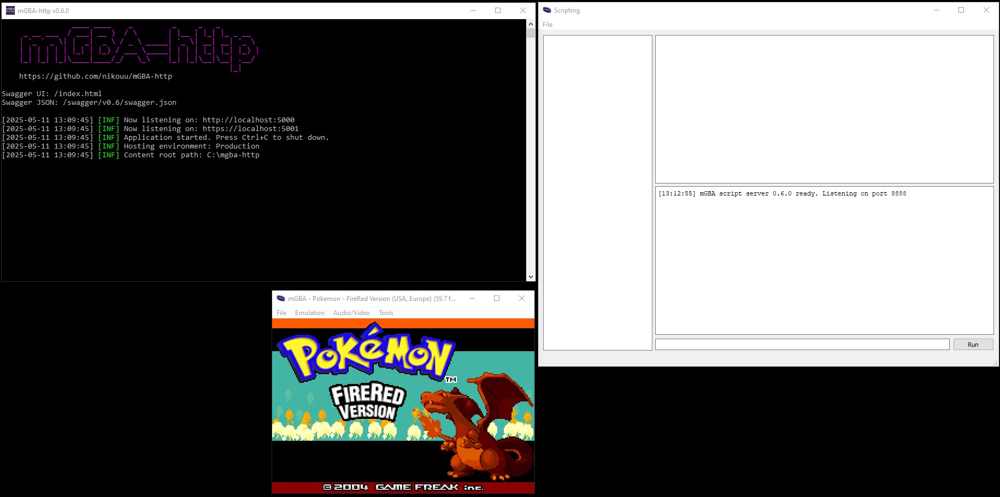
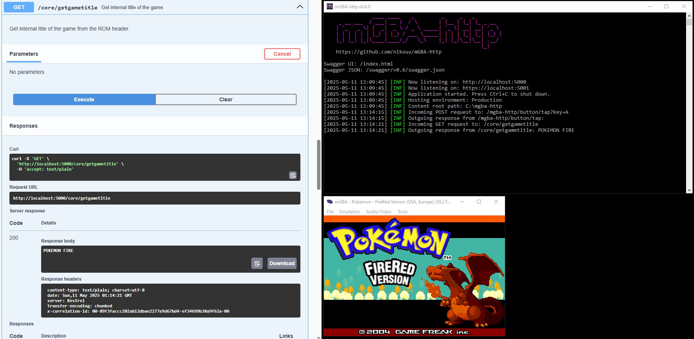

# Full Guide

## Setup

1. Ensure you have [mGBA](https://mgba.io/downloads.html)
1. Download both mGBA-http and `mGBASocketServer.lua` from the [Releases](https://github.com/nikouu/mGBA-http/releases/latest) section.
	- **Which mGBA-http?** 
		- If you have .NET installed download the smaller file type for your system. That is, the one without "self-contained" in the filename. 
		- If you do not have .NET installed, or are unsure, download the larger file type for your system. That is, the one with "self-contained" in the filename.
1. Run mGBA-http

1. Open mGBA and click Tools > Scripting to open the Scripting window.

1. In the scripting window click File > Load script to bring up the file picker dialog.

1. Select the `mGBASocketServer.lua` file you downloaded earlier
1. Load up a ROM in mGBA
1. Done. mGBA is now ready to accept commands from mGBA-http.

## Usage

When running, mGBA-http presents as a mostly non-interactiable console, with the default start information of:
- The bound address. This is the root for the commands. Default: `http://localhost:5000`
- The SwaggerUI address. Default: `http://localhost:5000/index.html`
- The Swagger JSON address. Default: `http://localhost:5000/swagger/v1/swagger.json`

Log entries of what commands are being sent as well as errors will show up in this console.

A quick way to begin to sending commands is heading to the SwaggerUI address and reqesting the ROM title as it requires no parameters:

See below for more examples, and the [mGBA scripting documentation](https://mgba.io/docs/scripting.html).

- To see what mGBA scripting APIs are implemented, see the [implemented APIs document](ImplementedApis.md).
- To see an overview of the swagger.json file, see the [API documentation](ApiDocumentation.md).
- Finally, the full [swagger.json](swagger.json) file.

### Configuration
If needed, there are minimal configuration points

#### appsettings.json
This file is **not** required for running mGBA-http normally. 

However, if you need to configure ports or logging, download this file from the releases page and put it in the same directory as mGBA-http. mGBA-http will pick up on these settings when run. See the [ASP.NET Core logging documentation](https://learn.microsoft.com/en-us/aspnet/core/fundamentals/logging/?view=aspnetcore-8.0#configure-logging) for more.

See below how the HTTP port has changed from the `5000` to `6969` and there is now an HTTPS endpoint as well at `6970`. Harder to picture is the log levels are now mostly set to warning, from the in-built defaults of error.

#### mGBASocketServer.lua

At the top, there is the `enableLogging` flag. This will output timestamped logs to the scripting console if set to `true`. Otherwise set to `false` for no logging.

### Gotchas
- Make sure not to load the script twice. This causes issues with recieving data. If you need to reload the script, close and reopen mGBA then load up the script again. Closing and reopening the scripting window is not enough. 
- Most commands require a ROM being loaded into mGBA.
- Unless you change the ports in both appsettings.json and in mGBASocketServer.lua, you cannot run more than one instance of mGBA-http.

### Examples
1. See the [examples page](Examples.md).
1. There is a test console project where you can send keys to mGBA.
